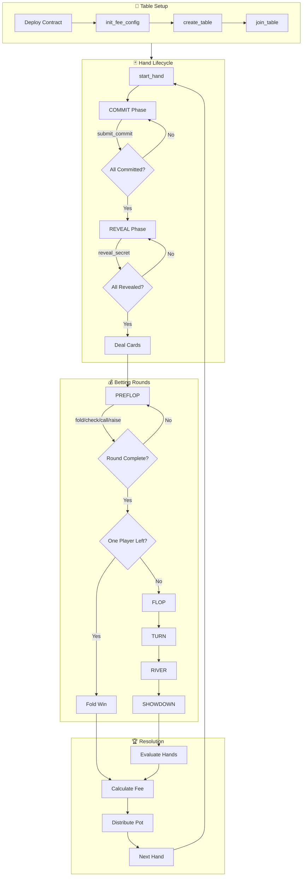

# Deployment Guide - 5-Seat Texas Hold'em

## Latest Deployment

**Version:** 6.0.0 (Fractional Fee Accumulator)  
**Date:** 2025-12-26  
**Network:** Cedra Testnet

### Contract Address
```
0x4d5a5fa1dae6d81ed71492a873fc358766a2d55d7020c44bd5b9e68f9ca1dbf5
```

### Fee Configuration
- **Fee Rate:** 0.5% (50 basis points)
- **Fee Collector:** `0xb40f35d81198adc541df553d429653fdffc32163e44228433d7d2ec0fa05bf87`
- **Fee Admin:** `0x4d5a5fa1dae6d81ed71492a873fc358766a2d55d7020c44bd5b9e68f9ca1dbf5`

### Transaction
- **Deploy Hash:** `0x24261c14c08b0de68fe6831afa76e99b97b85541b94b651cf092b17ccf3a4a6e`
- **Fee Init Hash:** `0x4e2e691666b900daf1a1ab632310361aa81705c042dba9dbae2d2075d989b796`
- **Explorer:** [View on Cedrascan](https://cedrascan.com/txn/0x24261c14c08b0de68fe6831afa76e99b97b85541b94b651cf092b17ccf3a4a6e?network=testnet)
- **Status:** ✅ Executed successfully
- **Gas Used:** 27,654 units

### Deployed Modules
- `chips` - Chip token system (FA-based)
- `hand_eval` - Hand evaluation logic
- `pot_manager` - Pot & side pot management
- `poker_events` - 25 event types
- `texas_holdem` - Core game logic with admin controls + global fee config + fee accumulator

### Profile
- **Name:** `holdem_deployer_v5`
- **Network:** Testnet

### Changes in v6.0.0
- **Fractional Fee Accumulator:** Fees tracked in basis-points for precise 0.5% collection
- Fee rate increased from 0.3% to 0.5% (50 basis points)
- Added `fee_accumulator` field to Table struct for fractional tracking
- Added `get_fee_accumulator(table_addr)` view function
- Added `get_fee_basis_points()` view function
- Residual fees collected on table close
- **79 tests** now passing (7 new fee accumulator tests)

---

## Contract Workflow Diagram



---

## Quick Start

```bash
# Set contract address
export ADDR=0x4d5a5fa1dae6d81ed71492a873fc358766a2d55d7020c44bd5b9e68f9ca1dbf5

# Buy chips (0.1 CEDRA = 100 chips)
cedra move run --function-id $ADDR::chips::buy_chips \
  --args u64:100000000 --profile holdem_deployer_v5

# Create table (5/10 blinds, 100-10000 buy-in, no ante, straddle enabled)
cedra move run --function-id $ADDR::texas_holdem::create_table \
  --args u64:5 u64:10 u64:100 u64:10000 u64:0 bool:true \
  --profile holdem_deployer_v5

# Join table at seat 0 with 500 chips
cedra move run --function-id $ADDR::texas_holdem::join_table \
  --args address:<TABLE_ADDR> u64:0 u64:500 --profile holdem_deployer_v5

# Start hand
cedra move run --function-id $ADDR::texas_holdem::start_hand \
  --args address:<TABLE_ADDR> --profile holdem_deployer_v5
```

---

## Post-Deployment Fee Setup

After deploying, initialize the fee collector (run once):

```bash
cedra move run \
  --function-id $ADDR::texas_holdem::init_fee_config \
  --args address:<FEE_COLLECTOR_ADDRESS> \
  --profile holdem_deployer_v5
```

To update the fee collector later:

```bash
cedra move run \
  --function-id $ADDR::texas_holdem::update_fee_collector \
  --args address:<NEW_FEE_COLLECTOR_ADDRESS> \
  --profile holdem_deployer_v5
```

---

## Previous Deployments

| Version | Date | Address | Profile | Notes |
|---------|------|---------|---------|-------|
| 1.0.0 | 2025-12-21 | `0x736ddb...557b` | holdem_testnet | Initial edge-case fixes |
| 2.0.0 | 2025-12-21 | `0x88d4e4...665f` | holdem_v2 | Frontend integration |
| 3.0.0 | 2025-12-22 | `0xb45d81...574b` | holdem_deployer_V1 | Bug fixes + Admin controls |
| 4.0.0 | 2025-12-23 | `0xfab3ac...1fd3` | holdem_deployer_v2 | Hole cards display |
| 4.1.0 | 2025-12-25 | `0x6ff41e...9aa3` | holdem_deployer_v3 | Service fees (per-table) |
| 5.0.0 | 2025-12-25 | `0x238498...2d5a` | holdem_deployer_v4 | Global fee collector |
| 6.0.0 | 2025-12-26 | `0x4d5a5f...dbf5` | holdem_deployer_v5 | Fractional fee accumulator |

---

## Redeployment

```bash
# Create new profile
cedra init --profile <name> --network testnet

# Deploy with named address
cedra move publish --profile <name> \
  --named-addresses holdemgame=<PROFILE_ADDRESS> --assume-yes

# Initialize fee collector (required!)
cedra move run --function-id <ADDR>::texas_holdem::init_fee_config \
  --args address:<FEE_COLLECTOR_ADDRESS> --profile <name>
```

---

## Frontend Configuration

Update `packages/frontend/.env`:
```
VITE_CONTRACT_ADDRESS=0x4d5a5fa1dae6d81ed71492a873fc358766a2d55d7020c44bd5b9e68f9ca1dbf5
```

Or update `packages/frontend/src/config/contracts.ts`:
```typescript
export const CONTRACT_ADDRESS = "0x4d5a5fa1dae6d81ed71492a873fc358766a2d55d7020c44bd5b9e68f9ca1dbf5";
```

