# 5-Seat Texas Hold'em - Technical Documentation

**Version:** 6.0.0  
**Last Updated:** 2025-12-26

## Overview

A fully on-chain casino-grade Texas Hold'em poker game for 5 players, built on the Cedra blockchain using the Move programming language.

---

## Architecture

```
┌─────────────────────────────────────────────────────────────┐
│                        texas_holdem.move                     │
│              (Core Game Logic & Table Management)            │
├─────────────────────────────────────────────────────────────┤
│     poker_events.move     │        pot_manager.move          │
│       (25 Event Types)    │      (Pot & Bet Tracking)        │
├───────────────────────────┼──────────────────────────────────┤
│       chips.move          │         hand_eval.move           │
│    (Fungible Asset)       │      (Hand Evaluation)           │
└─────────────────────────────────────────────────────────────┘
```

---

## Contract Workflow

```mermaid
flowchart TB
    subgraph Setup["🎰 Table Setup"]
        A[Deploy Contract] --> B[init_fee_config]
        B --> C[create_table]
        C --> D[join_table]
    end
    
    subgraph HandFlow["🃏 Hand Lifecycle"]
        E[start_hand] --> F[COMMIT Phase]
        F -->|submit_commit| G{All Committed?}
        G -->|No| F
        G -->|Yes| H[REVEAL Phase]
        H -->|reveal_secret| I{All Revealed?}
        I -->|No| H
        I -->|Yes| J[Shuffle & Deal]
    end
    
    subgraph Betting["💰 Betting Rounds"]
        J --> K[PREFLOP]
        K -->|Player Actions| L{Round Complete?}
        L -->|No| K
        L -->|Yes| M{One Player?}
        M -->|Yes| R[Fold Win]
        M -->|No| N[FLOP → TURN → RIVER]
        N --> Q[SHOWDOWN]
    end
    
    subgraph Resolution["🏆 Resolution"]
        Q --> S[Evaluate Hands]
        R --> T[Fee Accumulator]
        S --> T
        T --> U[Distribute Pot]
        U --> V[Next Hand]
        V --> E
    end
```



---

## Modules

### 1. `chips.move` - Chip Token System

Custom Fungible Asset (FA) token for in-game currency.

#### Exchange Rate
- **1 CEDRA = 1000 CHIP tokens**

#### Public Entry Functions

| Function | Description |
|----------|-------------|
| `buy_chips(player, cedra_amount)` | Exchange CEDRA for chips |
| `cash_out(player, chip_amount)` | Exchange chips back to CEDRA |

#### View Functions

| Function | Returns |
|----------|---------|
| `balance(player)` | Player's chip balance |
| `get_metadata()` | FA metadata object |
| `get_treasury_balance()` | Total CEDRA in treasury |
| `get_exchange_rate()` | Chips per CEDRA (1000) |

---

### 2. `hand_eval.move` - Hand Evaluation Engine

Evaluates 7-card hands to determine the best 5-card poker hand.

#### Hand Rankings (0-9)

| Value | Hand | Tiebreaker |
|-------|------|------------|
| 0 | High Card | 5 kickers |
| 1 | One Pair | Pair + 3 kickers |
| 2 | Two Pair | High + low pair + kicker |
| 3 | Three of a Kind | Trips + 2 kickers |
| 4 | Straight | High card |
| 5 | Flush | 5 card ranks |
| 6 | Full House | Trips + pair |
| 7 | Four of a Kind | Quads + kicker |
| 8 | Straight Flush | High card |
| 9 | Royal Flush | None |

#### Card Encoding
- Cards: `u8` values 0-51
- `card = suit * 13 + rank`
- Ranks: 0=2, 1=3, ..., 12=A
- Suits: 0=♣, 1=♦, 2=♥, 3=♠

---

### 3. `pot_manager.move` - Pot Management

#### Key Functions

| Function | Description |
|----------|-------------|
| `new(num_players)` | Create pot state |
| `add_bet(state, idx, amount)` | Record bet |
| `get_call_amount(state, idx)` | Call amount |
| `collect_bets(state, non_folded)` | Create pots |
| `calculate_distribution(...)` | Calculate payouts |
| `get_current_bets(state)` | All current bets |
| `get_total_invested(state)` | All totals |

#### Odd Chip Rule
Remainder chip goes to first-to-act winner (left of dealer).

---

### 4. `texas_holdem.move` - Core Game Logic

#### Game Phases

| Phase | Value | Description |
|-------|-------|-------------|
| WAITING | 0 | No active hand |
| COMMIT | 1 | Collecting hashes |
| REVEAL | 2 | Collecting secrets |
| PREFLOP | 3 | First betting |
| FLOP | 4 | 3 community cards |
| TURN | 5 | 4th card |
| RIVER | 6 | 5th card |
| SHOWDOWN | 7 | Evaluation |

#### Player Status

| Status | Value |
|--------|-------|
| WAITING | 0 |
| ACTIVE | 1 |
| FOLDED | 2 |
| ALL_IN | 3 |

---

## Entry Functions

### Table Management

```move
create_table(admin, sb, bb, min, max, ante, straddle_enabled)
join_table(player, table_addr, seat_idx, buy_in)
leave_table(player, table_addr)
close_table(admin, table_addr)  // Delete table, refund chips
```

### Player Controls

```move
sit_out(player, table_addr)           // Won't be dealt
sit_in(player, table_addr)            // Resume play
top_up(player, table_addr, amount)    // Add chips between hands
leave_after_hand(player, table_addr)  // Queue departure
cancel_leave_after_hand(player, table_addr)
```

### Hand Lifecycle

```move
start_hand(table_addr)
submit_commit(player, table_addr, hash)
reveal_secret(player, table_addr, secret)
```

### Player Actions

```move
fold(player, table_addr)
check(player, table_addr)
call(player, table_addr)
raise_to(player, table_addr, amount)
all_in(player, table_addr)
straddle(player, table_addr)  // 2x BB from UTG
```

### Admin Controls

```move
update_blinds(admin, table_addr, sb, bb)
update_ante(admin, table_addr, ante)
toggle_straddle(admin, table_addr, enabled)
update_buy_in_limits(admin, table_addr, min, max)
kick_player(admin, table_addr, seat_idx)
force_sit_out(admin, table_addr, seat_idx)
transfer_ownership(admin, table_addr, new_admin)
pause_table(admin, table_addr)
resume_table(admin, table_addr)
toggle_admin_only_start(admin, table_addr, enabled)
emergency_abort(admin, table_addr)  // Refund all bets
handle_timeout(table_addr)
```

### Global Fee Configuration

```move
// Called once after deployment by module deployer
init_fee_config(deployer, fee_collector)

// Update fee collector address (fee admin only)
update_fee_collector(admin, new_collector)

// Transfer fee admin rights
transfer_fee_admin(admin, new_admin)
```

---

## View Functions

### Table Metadata

| Function | Returns |
|----------|---------|
| `get_table_config(addr)` | (sb, bb, min, max) |
| `get_table_config_full(addr)` | (sb, bb, min, max, ante, straddle, fee_bps) |
| `get_table_state(addr)` | (hand_num, dealer, next_bb, fees) |
| `is_table_paused(addr)` | bool |
| `is_admin_only_start(addr)` | bool |
| `get_admin(addr)` | address |
| `get_seat_count(addr)` | (occupied, total) |
| `get_missed_blinds(addr)` | vector\<u64\> |

### Fee Functions

| Function | Returns |
|----------|---------|
| `get_fee_collector()` | Current fee collector address |
| `get_fee_admin()` | Current fee admin address |
| `is_fee_config_initialized()` | bool |
| `get_fee_accumulator(table_addr)` | Current accumulator value (basis-points) |
| `get_fee_basis_points()` | Fee rate (50 = 0.5%) |

### Action State

| Function | Returns |
|----------|---------|
| `get_action_on(addr)` | (seat_idx, player_addr, deadline) |
| `get_action_deadline(addr)` | u64 |
| `get_min_raise(addr)` | u64 |
| `get_max_current_bet(addr)` | u64 |
| `get_commit_deadline(addr)` | u64 |
| `get_reveal_deadline(addr)` | u64 |
| `get_last_aggressor(addr)` | seat_idx |

### Seating

| Function | Returns |
|----------|---------|
| `get_seat_info(addr, idx)` | (player, chips, sitting_out) |
| `get_seat_info_full(addr, idx)` | (player, chips, sitting_out, bet, status) |
| `get_player_seat(addr, player)` | seat_idx |
| `get_players_in_hand(addr)` | vector\<u64\> |
| `get_player_statuses(addr)` | vector\<u8\> |
| `get_pending_leaves(addr)` | vector\<bool\> |

### Game State

| Function | Returns |
|----------|---------|
| `get_game_phase(addr)` | u8 |
| `get_pot_size(addr)` | u64 |
| `get_community_cards(addr)` | vector\<u8\> |
| `get_commit_status(addr)` | vector\<bool\> |
| `get_reveal_status(addr)` | vector\<bool\> |
| `get_current_bets(addr)` | vector\<u64\> |
| `get_total_invested(addr)` | vector\<u64\> |
| `get_call_amount(addr, idx)` | u64 |

### Constants

| Function | Returns |
|----------|---------|
| `get_timeout_penalty_percent()` | 10 |
| `get_action_timeout_secs()` | 60 |
| `get_max_seats()` | 5 |

---

### 5. `poker_events.move` - Events

25 event types for frontend observability:

| Category | Events |
|----------|--------|
| **Table** | TableCreated, TableClosed, TableConfigUpdated |
| **Players** | PlayerJoined, PlayerLeft, PlayerSatOut, PlayerSatIn, PlayerToppedUp, PlayerKicked |
| **Hand** | HandStarted, CommitSubmitted, RevealSubmitted, CardsDealt, PhaseChanged, CommunityCardsDealt |
| **Actions** | BlindsPosted, AntesPosted, StraddlePosted, PlayerFolded, PlayerChecked, PlayerCalled, PlayerRaised, PlayerWentAllIn |
| **Results** | ShowdownStarted, PotAwarded, HandEnded, FoldWin |
| **Timeout** | TimeoutTriggered, HandAborted |
| **Admin** | OwnershipTransferred, FeeRecipientUpdated |

---

## Randomness: Commit-Reveal

1. **COMMIT**: Players submit `SHA3_256(secret)` hashes
2. **REVEAL**: Secrets verified against commits
3. **Shuffle**: Combined secrets → seed → Fisher-Yates

```
seed = SHA3_256(secret_1 || secret_2 || ... || secret_n)
```

---

## Timeout Enforcement

| Phase | Timeout | Penalty |
|-------|---------|---------|
| COMMIT | 120s | Sit out, abort hand |
| REVEAL | 120s | 10% chip penalty, abort |
| ACTION | 60s | Auto-fold |

---

## Service Fees

### Fractional Fee Accumulator

```move
FEE_BASIS_POINTS = 50  // 0.5%
```

The fee system uses a **fractional accumulator** for precise fee collection:

```move
// Each hand adds to the accumulator
fee_accumulator += pot * FEE_BASIS_POINTS;  // e.g., 72 chips × 50 = 3600

// Only whole chips are collected
fee_to_collect = fee_accumulator / 10000;   // 3600 / 10000 = 0
fee_accumulator = fee_accumulator % 10000;  // Keep 3600 remainder

// Eventually accumulator crosses threshold and fee is collected
```

**Example over 4 hands:**
| Hand | Pot | Add to Acc | Total Acc | Fee Collected | Remainder |
|------|-----|-----------|-----------|---------------|-----------|
| 1 | 72 | 3600 | 3600 | 0 | 3600 |
| 2 | 108 | 5400 | 9000 | 0 | 9000 |
| 3 | 80 | 4000 | 13000 | **1** | 3000 |
| 4 | 100 | 5000 | 8000 | 0 | 8000 |

This ensures **exact 0.5% collection** over time regardless of individual pot sizes.

### Fee Collector Setup

```bash
# Initialize fee collector (run once after deployment)
cedra move run \
  --function-id <CONTRACT_ADDR>::texas_holdem::init_fee_config \
  --args address:<FEE_COLLECTOR_ADDRESS> \
  --profile <DEPLOYER_PROFILE>

# Update fee collector later (fee admin only)
cedra move run \
  --function-id <CONTRACT_ADDR>::texas_holdem::update_fee_collector \
  --args address:<NEW_FEE_COLLECTOR_ADDRESS> \
  --profile <FEE_ADMIN_PROFILE>
```

---

## Special Rules

### Heads-Up
- Dealer = Small Blind, acts first preflop
- Non-dealer = Big Blind

### All-In Runout
When all players all-in, remaining cards dealt automatically.

### Betting Round Completion
Complete when all ACTIVE players have acted AND matched current bet.

---

## Deployment

```bash
cedra move compile
cedra move publish --profile <profile> \
  --named-addresses holdemgame=<PROFILE_ADDRESS> --assume-yes
```

### Current Testnet Contract
```
0x4d5a5fa1dae6d81ed71492a873fc358766a2d55d7020c44bd5b9e68f9ca1dbf5
```

---

## Quick Start

```bash
ADDR=0x4d5a5fa1dae6d81ed71492a873fc358766a2d55d7020c44bd5b9e68f9ca1dbf5

# Step 1: Initialize fee collector (run once after deployment)
cedra move run --function-id $ADDR::texas_holdem::init_fee_config \
  --args address:$ADDR --profile <YOUR_PROFILE>

# Step 2: Create table (5/10 blinds, 100-10000 buy-in)
cedra move run --function-id $ADDR::texas_holdem::create_table \
  --args u64:5 u64:10 u64:100 u64:10000 u64:0 bool:true

# Buy chips
cedra move run --function-id $ADDR::chips::buy_chips \
  --args u64:10000000

# Join table
cedra move run --function-id $ADDR::texas_holdem::join_table \
  --args address:$TABLE u64:0 u64:500

# Start hand
cedra move run --function-id $ADDR::texas_holdem::start_hand \
  --args address:$TABLE
```
